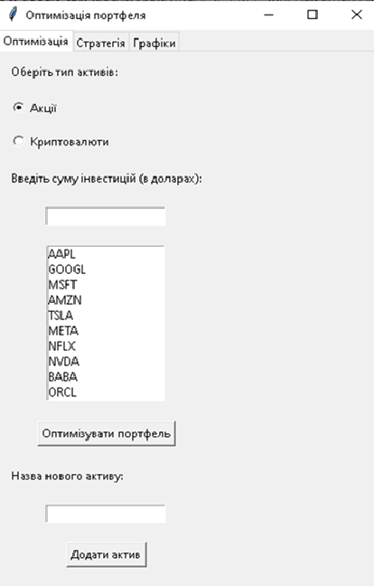
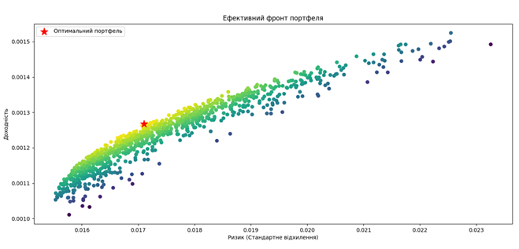
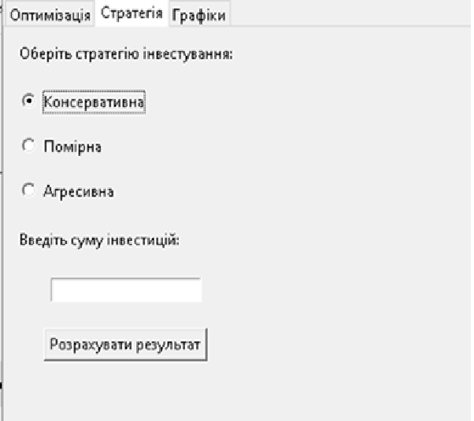
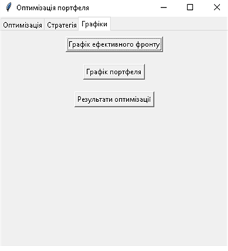
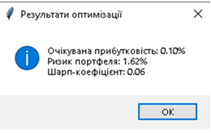

Portfolio Optimization Tool
Optimize stocks & crypto portfolios with Python – maximize returns, control risk.

# Key Features:
1. ✅Historical Data: stocks (AAPL, MSFT, TSLA) & crypto (BTC, ETH, ADA) via yfinance
2. ✅Optimization: markowitz & Genetic Algorithms for best return-to-risk ratio
3. ✅Metrics: portfolio return, risk, Sharpe ratio
4. ✅Visualization: efficient frontier plots
5. ✅Interactive GUI: tkinter lets users pick assets, strategies (Conservative, Moderate, Aggressive), and see results

# Impact:
1. Enabled data-driven investment decisions
2. Visualized risk-return trade-offs for actionable insights
3. Improved portfolio efficiency and stability
4. Tech: Python, Pandas, NumPy, Tkinter, Plotly

# Usage:

git clone https://github.com/annabelous75/investment_optimization.git

pip install -r requirements.txt

python project.py

Results:

